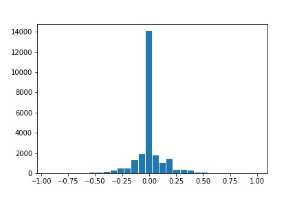
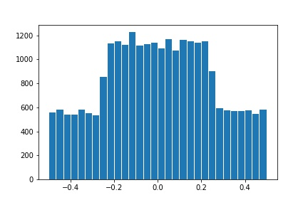

**Behavioral Cloning Project**

The goals of this project are the following:
* Use the simulator to collect data of good driving behavior.
* Build, a convolution neural network in Keras that predicts steering angles from images.
* Train and validate the model with a training and validation set.
* Test that the model successfully drives around track one without leaving the road.
* Summarize the results with a written report.

---
### Files Submitted & Code Quality

#### 1. Submission includes all required files and can be used to run the simulator in autonomous mode

My project includes the following files:
* [model.py](./model.py) containing the script to create and train the model.
* [drive.py](./drive.py) for driving the car in autonomous mode (unchanged).
* [model.h5](./model.h5) containing a trained convolution neural network.
* writeup.md (this file) summarizing the results.

#### 2. Submission includes functional code
Using the Udacity provided simulator and my drive.py file, the car can be driven autonomously around the track by executing 
```sh
python drive.py model.h5
```

#### 3. Submission code is usable and readable

The model.py file contains the code for training and saving the convolution neural network. The file shows the pipeline I used for training and validating the model, and it contains comments to explain how the code works.

### Model Architecture and Training Strategy

#### 1. An appropriate model architecture has been employed

My model consists of a convolution neural network with filter sizes 8, 5, 5  and depths of 16, 32, 128 respectively (model.py lines 142-153) followed by a fully connected layer with 512 hidden units. 

The model includes ELU layers to introduce nonlinearity after every layer, and the data is normalized and cropped in the model using a Keras lambda layer (code lines 140, 141).

This neural network architecture is inspired from the model published by [CommaAI](https://github.com/commaai/research/blob/master/train_steering_model.py) for the same task. However, they do not crop the images in the model definition.

#### 2. Attempts to reduce overfitting in the model

The model contains dropout layers in order to reduce overfitting. 

The model was trained and validated on artificially generated data set using the data provided by Udacity to ensure that the model was not overfitting (code line 19-122). The model was tested by running it through the simulator and ensuring that the vehicle could stay on the track.

#### 3. Model parameter tuning

The model used an adam optimizer, with the learning rate decay of 0.96, so the learning rate was not tuned manually (model.py line 236).

#### 4. Appropriate training data
The driving data provided by Udacity was used for training the initial model. In this data, the images from the center, left and right cameras were used with an appropriate offset in the steering angle for the left and right camera images (code line 70-78).

For details about how I created the training data, see the next section. 

### Architecture and Training Documentation

#### 1. Solution Design Approach

The overall strategy for deriving a model architecture was to incrementally refine a well defined model applied for the similar task by the researchers.

Thus, my first step was to use a convolution neural network model similar to the one defined by [CommaAI](https://github.com/commaai/research/blob/master/train_steering_model.py) I thought this model might be appropriate because it is a very simple (not very deep) convolutional neural network. As the dataset provided to has a very limited number of training images, a simpler model would not tend to overfit as much as a very deep network architecture would.

In order to gauge how well the model was working, I split the image and steering angle data into a training and validation set. I trained my model for 5 epochs and found that my first model had a low mean squared error on the training set but a high mean squared error on the validation set. This implied that the model was overfitting. 

To combat the overfitting, rather than modifying the model, I decided to augment the dataset so that the images corresponding to a more uniform distribution of the steering angles.

Then I retrained the model for 5 epochs using this data.

The final step was to run the simulator to see how well the car was driving around track one. There were a few spots where the vehicle went off the track like the left turn with dirt on the left side and the right turn. To improve the driving behavior in these cases, I collected some more data by driving around these regions. Then, appended this data with the Udacity provided data to generate more data and finetuned the model for another 5 epochs by loading the parameters from the last saved model.

At the end of the process, the vehicle is able to drive autonomously around the track without leaving the road.

#### 2. Final Model Architecture

The final model architecture consisted of a convolution neural network with the following layers and layer sizes.

| Layer (type) | Output Shape | Param # | 
| ------------ | ------------ | ------- |
| lambda_2 (Lambda) | (None, 160, 320, 3) | 0  |
| cropping2d_2 (Cropping2D) | (None, 80, 320, 3) | 0 |
| conv2d_4 (Conv2D) | (None, 20, 80, 16) | 3088 |
| elu_5 (ELU) | (None, 20, 80, 16) | 0 |
| conv2d_5 (Conv2D) | (None, 10, 40, 32) | 12832 |
| elu_6 (ELU) | (None, 10, 40, 32) | 0 |
| conv2d_6 (Conv2D) | (None, 5, 20, 64) | 51264 |
| flatten_2 (Flatten) | (None, 6400) | 0 |
| dropout_3 (Dropout) | (None, 6400) | 0 |
| elu_7 (ELU) | (None, 6400) | 0 |
| dense_3 (Dense) | (None, 512) | 3277312 |
| dropout_4 (Dropout) | (None, 512) | 0 |
| elu_8 (ELU) | (None, 512) | 0 |
| dense_4 (Dense) | (None, 1) | 513 |

Total trainable params: 3,345,009

#### 3. Creation of the Training Set & Training Process

To capture good driving behavior, I first recorded a lap on track one using center lane driving. However, I noticed that the data generated by me was not very smooth. Hence I decided to use the data provided in the course resources. One of the sample images is shown below.


The Udacity dataset had 24,108 images including the ones from left and right cameras. However, on the inspection of the histogram of the steering angles, a very high percentage of images had the steering angle less than 0.2. This can be seen in the following image.



In order to mitigate the effect of highly imbalanced data set, I used the python generator to generate artificial data which would be more balanced. For this, I randomly shifted, flipped the images. I also changed the brightness randomly. With this procedure, I was able to generate the dataset of 25,600 images and corresponding steering angle distribution is shown below.



I finally randomly shuffled the data set and generated 5120 images to use as a validation set. 

I used this training data for training the model. The validation set helped determine if the model was over or under fitting. As described above in the Solution approach, I trained the model for 10 epochs (5 epochs with initial data and then 5 more with the additional data around failed examples).

I used Adam optimizer with the initial learning rate of 0.001 and decay rate of 0.96. For finetuning, I reduced this learning rate to 0.0009.

---

### Reflections
Using this strategy I was able to record the driving in autonomous mode for a couple of laps. This can be seen the the outpout [video](./driving_record.mp4).

The strategy to attain a good driving behavior drives well on the Track 1, but will easily fail on Track 2 of the new simulator where there are lane lines. Thus, this presents the power and limitations of deep learning at the same time. Ideally, one should have ~100k images with varying conditions of the road and the environment to have a very robust model.
